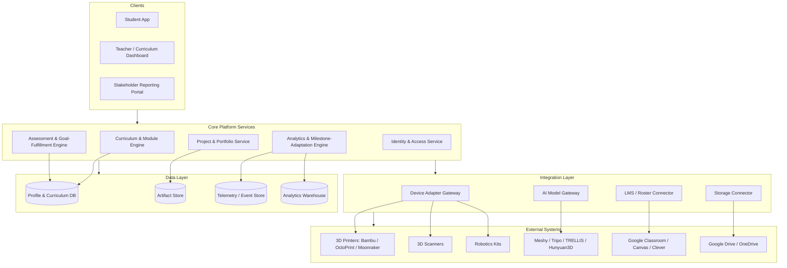
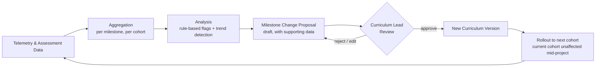

# Future Makers Pathway — System Architecture & Implementation Plan

**Scope:** the software system that delivers the 4-module (Year 1–4) curriculum, integrates with the AI/3D-printing/robotics tool stack, and continuously collects, analyzes, and evaluates goal-fulfillment data to adapt the program's own milestones over time.

**Design principle:** the platform applies the same loop it teaches students. The system never silently rewrites curriculum on its own — it proposes milestone changes from data, and a human (curriculum lead / teacher) evaluates and approves before anything ships to a cohort. Automated intent-setting is intentionally excluded from this system.

---

## 1. Goals

1. Deliver and track the 4-year curriculum (Foundations → Applied Generation → Precision & Systems → Capstone) at the level of module → project → milestone → rubric criterion.
2. Give every student a portfolio record of their actual work — generation attempts, iteration history, scans, CAD files, print logs, capstone documentation.
3. Bridge to the physical/AI tool stack (printers, scanners, robotics kits, generation APIs) without hard-coding to any one vendor, since these tools will churn faster than the 4-year program.
4. Continuously measure goal fulfillment (did this student meet this milestone, and how) and feed that signal into a milestone-adaptation loop, always with a human approval gate.
5. Respect that every user is a minor — data minimization and guardian consent are load-bearing requirements, not an afterthought.

---

## 2. High-Level Architecture



**Why an integration layer exists at all:** printers, scanners, and generation models are exactly the parts of this stack most likely to be replaced over a 4-year program. Every external tool sits behind an adapter interface (Section 6) so a vendor swap is a config change, not a rewrite.

---

## 3. Core System Components

### 3.1 Curriculum & Module Engine
- Represents the program as a versioned graph: `Year → Module → Unit → Project → Milestone → Rubric Criterion`.
- Curriculum is defined as data (YAML/JSON), not hard-coded — stored in a git-backed repository so every milestone change has a diff, an author, and a rationale, mirroring how the adaptation loop in Section 8 proposes changes.
- Supports parallel curriculum versions so a milestone change can roll out to next year's Year-1 cohort without altering what a current Year-2 cohort is already mid-project on.

### 3.2 Project & Portfolio Service
- Stores every artifact a student produces: CAD files, generated meshes, scan data, print logs, iteration history, capstone documentation.
- Every artifact links back to the milestone/rubric criterion it satisfies — this is what makes "goal fulfillment" measurable rather than just a grade.
- Doubles as the literal portfolio export used in Year 4 (Section 5.4).

### 3.3 Device & AI Integration Gateway
- A common adapter interface per device/service category (`GenerationProvider`, `PrintProvider`, `ScanProvider`, `RoboticsProvider`) — see Section 6.
- Handles per-school credentials and rate limits; local devices (printers, scanners, robotics kits) are typically LAN-only, so this gateway includes a lightweight **local agent** that runs on a classroom machine and relays to the cloud platform (Section 7.5).

### 3.4 Assessment & Goal-Fulfillment Engine
- Combines two signal types:
  - **Rubric-based teacher assessment** (structured scoring against milestone criteria)
  - **Automated milestone signals** (e.g., "print job completed," "tolerance check passed," "student flagged an AI-generated error and logged it")
- Goal-fulfillment score = a weighted combination of both, never automated assessment alone — a teacher's rubric score is always part of the record, not just a system-computed pass/fail.

### 3.5 Analytics & Milestone-Adaptation Engine
- Ingests telemetry: completion times, iteration counts, common failure points, which tools/providers are actually being used.
- Runs periodic analysis (recommended: end of term) to flag candidate issues — a milestone that's systematically too hard, a tool that's been deprecated by its vendor, a project that no longer reflects current practice.
- Outputs a **Milestone Change Proposal**, never an automatic change. A curriculum lead reviews, edits, and approves before a new curriculum version is cut. This is the system-level version of the "human sets intent → AI proposes → human evaluates → AI refines" loop taught in Module 1 — the platform models the exact habit it's trying to teach.

### 3.6 Identity & Access Service
- Roles: `Student`, `Guardian`, `Teacher`, `Curriculum Lead`, `Industry Mentor`, `District Admin`.
- SSO against the school's existing identity provider (Google Workspace for Education, Microsoft Entra ID, or Clever/ClassLink for K-12 roster sync) rather than a platform-native login — schools already have this infrastructure, and standing up a parallel identity system for minors is both unnecessary risk and unnecessary cost.

---

## 4. Data Model (Core Entities)

```
School
 └─ Cohort (e.g., "2026 Junior Track")
     └─ Student ─── Guardian (consent record)

CurriculumVersion
 └─ Module (Year 1–4)
     └─ Unit
         └─ Project
             └─ Milestone
                 └─ RubricCriterion

ProjectSubmission (student × project)
 ├─ Artifact (file: CAD / STL / scan / generation log)
 └─ IterationLog (entry per attempt: input, provider used, output, student note)

AssessmentRecord (submission × rubric criterion × teacher)
GoalFulfillmentScore (submission × milestone, computed)

TelemetryEvent (append-only: device/provider used, duration, outcome, error type)

MilestoneChangeProposal
 ├─ generated_from: TelemetryEvent[] + AssessmentRecord[]
 ├─ status: draft | under_review | approved | rejected
 └─ MilestoneChangeApproval (curriculum_lead_id, decision, rationale)

DeviceRegistration (school × classroom × device type × provider)
ProviderCredential (school × provider × auth token, scoped per site)
```

---

## 5. Module-to-Feature Mapping

| Module | Core system features required |
|---|---|
| **Year 1 — Foundations** | Safety-certification tracker (pass/fail + date); personal "object of the year" project record with milestones spread across terms; cloud-tier generation-provider integration only (no local GPU dependency); basic print-job tracking via local agent |
| **Year 2 — Applied Generation** | Multi-provider comparison tool (run the same input through two providers, log both outputs side by side); mesh-repair action log (what was fixed, before/after); embedded scripting sandbox (Python notebook, sandboxed); iteration log as a first-class UI surface, not a hidden table |
| **Year 3 — Precision & Systems** | Scan-ingestion pipeline (upload + metadata); CAD fit-verification recorder (tolerance pass/fail against a mating-part reference, with measurement fields, not just a checkbox); robotics telemetry ingestion (sensor/actuator logs from a small platform); local-GPU provider adapter for self-hosted models |
| **Year 4 — Capstone & Career** | Full workflow orchestration checklist (scan → AI-assisted fill → verify → print → install, with a required human sign-off at the verify step before print is allowed to be marked "ready to install"); portfolio export/report generator; mentor review workflow (external reviewer role, scoped read access); career-pathway module (self-reported interest survey feeding into the reporting dashboard, not a scored assessment) |

---

## 6. External APIs & Platform Integrations

| Category | Vendor / Platform | Integration shape | Notes |
|---|---|---|---|
| 3D generation | Meshy AI, Tripo AI | REST API, cloud-hosted | Entry-tier default; no local GPU required |
| 3D generation | TRELLIS.2, Hunyuan3D 2.1 | Self-hosted inference server behind a thin internal REST wrapper | Advanced tier; requires the school's local-GPU workstation (Section 7 of the earlier hardware slide) |
| Fabrication | Bambu Lab Cloud API / Bambu Connect | Cloud API + local bridge | Confirm current API terms with Bambu directly before integrating — vendor cloud APIs change without notice |
| Fabrication | OctoPrint REST API, Moonraker (Klipper) | Local REST/WebSocket via classroom agent | For non-Bambu printers in the advanced-tier lab |
| Fabrication orchestration | MCP-based print servers (e.g., Kiln) | Local MCP server | Optional — useful if the platform later exposes an agent-facing interface for teachers/students |
| Scanning | Vendor SDKs (Revopoint, Einstar, etc.) | Desktop SDK, not typically REST | Export via local agent file-drop + upload, not a live API integration |
| Robotics | Serial-over-USB (micro:bit / Arduino) or ROS2 bridge | Local agent | Scope depends on which robotics platform Year 3 standardizes on |
| Roster / SSO | Google Classroom API, Clever, ClassLink | OAuth2 + roster sync | Use the school's existing system rather than a platform-native roster |
| Storage | Google Drive API, Microsoft OneDrive API | OAuth2, per-student folder | Portfolio artifact backup, not primary storage |
| Notifications | Transactional email/SMS provider | REST | Guardian consent flows, milestone/term reports |

**Note on vendor APIs:** several of the above (Bambu's cloud API in particular) change terms and availability without much notice — before committing an integration to a specific vendor endpoint, verify current documentation directly rather than relying on this plan as a source of truth for API specifics.

---

## 7. Repository / File Structure

```
future-makers-platform/
├── apps/
│   ├── student-app/                 # React web app (+ PWA wrapper for tablets)
│   ├── teacher-dashboard/           # Curriculum lead + teacher console
│   └── stakeholder-portal/          # Read-only reporting for district/admin
│
├── services/
│   ├── curriculum-engine/           # Module/Unit/Project/Milestone graph, versioning
│   ├── portfolio-service/           # Artifacts, iteration logs
│   ├── assessment-service/          # Rubric scoring, goal-fulfillment computation
│   ├── analytics-engine/            # Telemetry aggregation, milestone-change proposals
│   ├── identity-service/            # SSO, roles, guardian consent records
│   └── integration-gateway/
│       ├── ai-providers/            # Meshy / Tripo / TRELLIS / Hunyuan3D adapters
│       ├── device-providers/        # Printer / scanner / robotics adapters
│       └── lms-connectors/          # Google Classroom / Clever / roster sync
│
├── local-agent/                     # Runs on a classroom machine; bridges LAN-only
│   │                                 # devices (printers, scanners, robotics) to cloud
│   ├── printer-bridge/
│   ├── scanner-uploader/
│   └── robotics-listener/
│
├── curriculum-data/                 # Git-tracked curriculum-as-data (YAML)
│   ├── year-1-foundations/
│   ├── year-2-applied-generation/
│   ├── year-3-precision-systems/
│   └── year-4-capstone/
│
├── infra/
│   ├── terraform/                   # Cloud infra as code
│   └── docker/
│
└── docs/
    ├── architecture/                # This file and related ADRs
    └── privacy/                     # Consent flows, data-retention policy
```

---

## 8. Milestone-Adaptation Feedback Loop



**What triggers a proposal (examples, not automatic decisions):**
- A milestone's completion time or failure rate is a significant outlier versus prior cohorts.
- A provider or tool referenced in a milestone becomes deprecated or inaccessible (e.g., an API is retired).
- Teacher-submitted qualitative notes repeatedly flag the same friction point.

**What the system never does:** auto-apply a milestone change, auto-lower a rubric standard to fit a struggling cohort, or surface a "recommended change" as if it were already decided. The proposal is a draft with its supporting data attached — the curriculum lead's judgment is the actual decision-maker, consistent with the program's own pedagogical stance that a confident system output still needs a human check before it's trusted.

---

## 9. Privacy, Safety & Compliance

- **Every user is a minor.** Data collection should default to the minimum needed to run the program (portfolio artifacts, rubric scores, aggregated telemetry) — not behavioral tracking beyond what a milestone actually requires.
- **Guardian consent** is a first-class record (`Guardian` entity, Section 4), not a one-time signup checkbox — consent status should be checkable per student at any time.
- **Jurisdiction matters and this plan doesn't resolve it.** Depending on where a partner school is located, the applicable student-data regulations differ substantially (e.g., FERPA/COPPA in the U.S., GDPR-derived rules in the EU, and separate student-data and cybersecurity/data-export rules across Taiwan, Hong Kong, and mainland China). This document should not be treated as a compliance determination — route the data model in Section 4 through the school's or district's own legal/compliance review before launch, and expect the storage/hosting-location decisions in Section 10 to be partly dictated by that review rather than by engineering preference alone.
- **Mentor and stakeholder access is scoped and read-only** where possible — an industry mentor should see the capstone submission they're reviewing, not a student's full multi-year record.

---

## 10. Recommended Tech Stack (starting point, not a mandate)

| Layer | Suggestion | Why |
|---|---|---|
| Backend services | Python (FastAPI) or TypeScript (NestJS) | Both integrate cleanly with the AI-provider adapters and have mature auth/ORM tooling |
| Primary DB | PostgreSQL | Relational structure fits the curriculum graph and assessment records well |
| Artifact storage | S3-compatible object store | Large binary files (STL, scans) don't belong in the relational DB |
| Telemetry / events | Managed queue (e.g., a hosted Kafka/PubSub equivalent) → analytics warehouse | Decouples real-time collection from periodic analysis |
| Analytics warehouse | BigQuery / Snowflake-class | For the termly milestone-analysis runs in Section 8 |
| Frontend | React (web-first), PWA wrapper for tablet use in the workshop | Avoids a separate native-app maintenance burden for a pilot-stage program |
| Local agent | Lightweight service (e.g., a small Python or Node process) on a classroom machine | Required because printers/scanners/robotics kits are LAN-only |

---

## 11. Build Phases (mapped to the earlier program rollout)

| System phase | Program phase | System scope |
|---|---|---|
| **Phase 1** | Pilot (single school, Year 1 cohort) | Curriculum engine, portfolio service, one cloud AI-provider adapter, basic teacher dashboard — no analytics engine yet, data collected manually if needed |
| **Phase 2** | Expansion (Year 2 curriculum added, 2–3 partner schools) | Multi-tenant identity/roster, multi-provider AI gateway, local-agent printer bridge |
| **Phase 3** | Full track (Years 3–4 live, advanced-tier hardware) | Scan-ingestion pipeline, robotics telemetry, analytics engine goes live with first milestone-change proposals, mentor review workflow |
| **Phase 4** | Regional scale | Stakeholder reporting portal, cross-school analytics, self-hosted AI-provider adapters for schools with advanced-tier labs |

---

## 12. Open Decisions Before Build

- **Self-hosted vs. cloud AI generation budget tradeoff** — advanced-tier local models (TRELLIS.2, Hunyuan3D) require GPU infrastructure per school; this is a cost and IT-support decision, not just a technical one.
- **Data residency** — where student data is hosted may be constrained by the compliance review in Section 9, and should be settled before the storage layer (Section 10) is finalized.
- **LMS choice per partner school** — schools may already standardize on Google Classroom, Canvas, or something else; the roster connector (Section 6) should be built against whichever is actually in use, not a platform assumption.
- **Ownership of the milestone-adaptation approval role** — who specifically holds "Curriculum Lead" authority across multiple partner schools (a single program-wide lead, or one per school) affects both the identity model (Section 3.6) and how consistently milestones stay comparable across cohorts.
